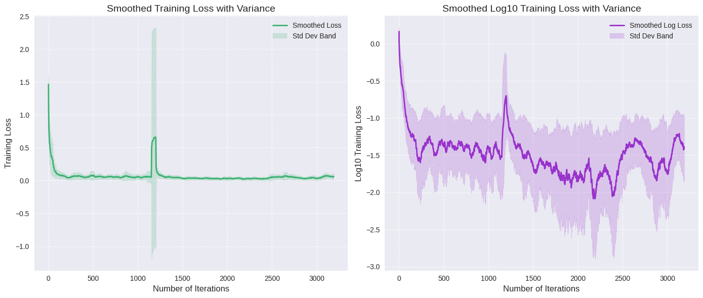
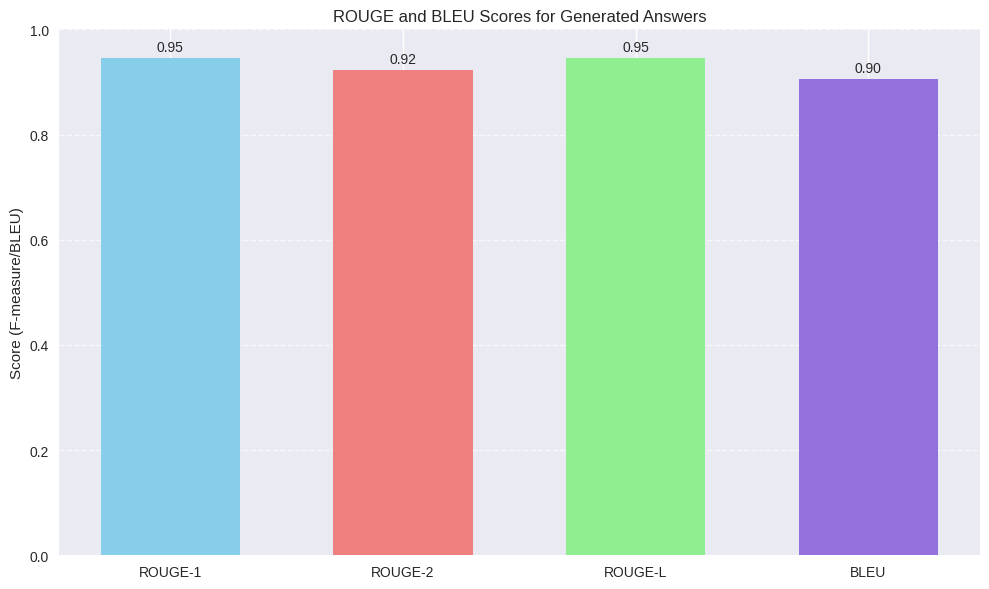
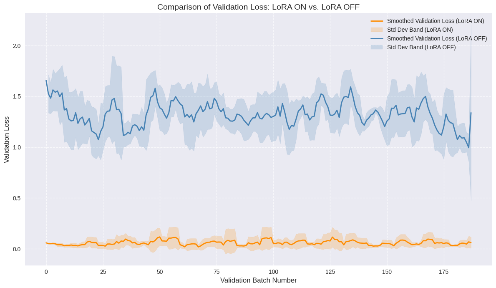

# Qwen2.5 Math Finetuning (NCERT Solutions)

This repository contains the code and configuration to finetune the **Qwen2.5-0.5B-Instruct** model specifically for solving NCERT-style mathematics problems. By leveraging LoRA (Low-Rank Adaptation), the model has been optimized to provide structured, step-by-step mathematical reasoning.

## 📊 Training Results & Metrics

The model showed significant convergence during the finetuning process. The drastic reduction in validation loss indicates that the model transitioned from general responses to highly specialized mathematical accuracy.
NOTE: As for some reason the jupyter file is not opening in github here is the link to original colab file
Link: https://colab.research.google.com/drive/1xCF9fCcP9cT1hw-peaTP-NlmiYiiTdmF?usp=sharing

| Metric | Initial | Final | Improvement |
| :--- | :--- | :--- | :--- |
| **Training Loss** | 0.0717 | **0.0440** | ~38.6% Reduction |
| **Avg. Validation Loss** | 1.3250 | **0.0596** | **~95.5% Reduction** |

## 📈 Visualizing Convergence
Below are the curves captured during the sessions:


loss curves and log loss curves


ROUGE1, ROUGE1, ROUGE3, BELU for the finetuned model


Validation loss before and after finetuning 

---

## 🚀 Features
* **Model:** Qwen2.5-0.5B-Instruct
* **Method:** Parameter-Efficient Fine-Tuning (PEFT) using **LoRA**.
* **Format:** ChatML (System, User, Assistant).
* **Task:** Step-by-step NCERT Math Problem Solving.

---

## 📂 Project Structure
```text
├── data/               # Training dataset (JSON)
├── src/                # Utility scripts for data & model loading
├── finetune.py         # Main training script
├── inference.py        # Test script for generating solutions
└── lora_adapters/      # Saved weights (generated after training)
```

## 🛠️ Installation & Usage

### Install Dependencies
```bash
pip install -r requirements.txt
```

### Start Finetuning
To run the training loop and save the adapters:
```bash
python finetune.py
```

### Run Inference
To test the model on a new math problem:
```bash
python inference.py
```
## 📥 Quick Start: Using Pre-trained Adapters
If you wish to skip the training process, you can use the pre-trained LoRA adapters directly:

Extract the contents of **lora_adapter.zip** into a folder named **lora_adapters/** in your project root.

Run Inference: The script will automatically load the base **Qwen2.5-0.5B-Instruct** model from Hugging Face and apply your local adapters.

---

## 🧪 Example Output
**User:** *Find the roots of the equation $x^2 - 3x - 10 = 0$.*

**Assistant:**
To find the roots of the quadratic equation $x^2 - 3x - 10 = 0$, we can use the factorization method:
1.  Identify two numbers that multiply to -10 and add to -3. These are -5 and +2.
2.  Rewrite the equation: $(x - 5)(x + 2) = 0$.
3.  Set each factor to zero: $x - 5 = 0$ or $x + 2 = 0$.
4.  The roots are **x = 5** and **x = -2**.

---

## 📜 License
This project is licensed under the MIT License.
