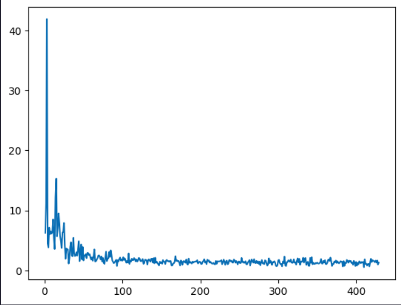
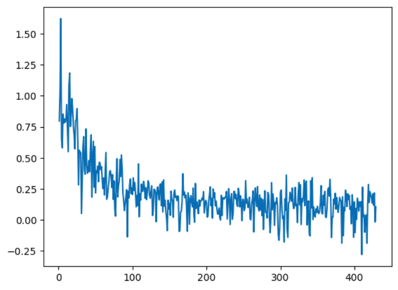

📝 Project README: MathGen-LLM Finetuning
🚀 Overview
## 🚀 Overview: MathGen-LLM Finetuning

This repository contains the scripts and configurations used to **finetune a Causal Language Model (CLM)** for enhanced mathematical reasoning and problem-solving. The finetuning process utilizes **LoRA (Low-Rank Adaptation)** on the **`google/gemma-2b`** model with a specialized dataset of **Class 11th and 12th NCERT math examples**.

The goal of this project is to create a model highly capable of providing detailed, step-by-step solutions to complex algebraic, trigonometric, and calculus problems typical of the Indian curriculum.

---

### 🧠 Model Mechanics and Improvement

The foundation of this project is the **Gemma 2B** model, a **Causal Language Model (CLM)** based on the **Transformer architecture**.

#### How Finetuning Improves Math Reasoning:
1.  **Specialized Knowledge Encoding:** The LoRA finetuning process shifts the model's focus from generic web content to the specific language, notation, and problem-solving structures found in NCERT math.
2.  **Enhanced Step-by-Step Logic:** The mathematical solutions in the training data teach the model to maintain **long-range dependency** between calculation steps. This improves the **causal logic** inherent in the CLM, ensuring that the model accurately carries results from one line to the next.
3.  **Efficiency via LoRA:** By injecting small, trainable adapter matrices (LoRA) into the model's attention and feed-forward layers, we specifically tune its ability to **attend to relevant parts of the equation** and **process those mathematical details** without the high cost of retraining the entire model. This is what allows the model to stop repeating the question and start generating a solution, as indicated by the rapid loss reduction in the training curves.

📊 Training Results: Loss Curves
The following plots illustrate the model's performance during the 3 epochs of LoRA finetuning. The training was performed using the PyTorch ecosystem within a Google Colab Free Tier environment.

1. Standard Loss Curve

The top curve, plotted using sns.lineplot(y=training_loss, x=number_iter), shows the model's Loss per iteration.

Observation: The loss starts high (above 40) but demonstrates a steep, immediate drop within the first 50 iterations, confirming the model quickly learned the fundamental patterns of the new math dataset. The loss stabilizes rapidly, which is a key sign of effective LoRA adaptation.

2. Log Loss Curve

The bottom curve shows the training loss scaled logarithmically per iteration.

Observation: The training loss quickly settles into a narrow, oscillating band centered around a low value (near 0.0 to 0.25 after iteration 100). This stable, low final loss indicates successful convergence and suggests the model is generating mathematically coherent and contextually relevant outputs on the finetuning data.

🛠️ Model and Technology Stack
Component	Detail

Base Model	google/gemma-2b

Finetuning Method	LoRA (Low-Rank Adaptation)

LoRA Rank (r)	16

Target Modules	q_proj, o_proj, k_proj, v_proj, gate_proj, up_proj, down_proj

Training Hardware	Google Colab (Free Version) - GPU

Finetuning Library	PEFT (Parameter-Efficient Finetuning)

Dataset	Class 11th & 12th NCERT Mathematics Examples

Export to Sheets
💻 How to Finetune Yourself
This section outlines the steps to reproduce the finetuning process using the modular scripts provided (config.py, data_utils.py, train.py).

1. Setup Environment
Clone the repository and install the necessary dependencies:

gh repo clone lakshyapathak69420/LLM-FInetunning-on-NCERT-Maths-class-11th-and-12th

cd LLM-FInetunning-on-NCERT-Maths-class-11th-and-12th

python3 -m venv .venv

source .venv/bin/activate

pip install -r requirements.txt

# Ensure you have the required libraries, including torch and transformers with GPU support
2. Prepare Data
Ensure your tokenized training data is available in the root directory.
Requirement: The script expects a file named tokenised_prompt.pkl (as referenced in config.py) containing a Pandas DataFrame with input_ids and attention_mask columns. 

3. Run Training
The training is handled entirely by the train.py script. All hyperparameters (epochs, LoRA rank, learning rate) are configurable within config.py.

4. Weights and Output
Upon completion (after 3 epochs), the LoRA adapter weights will be saved to a new directory named lora_weights using the peft.save_pretrained() method.

🧠 How to Use the Finetuned Model for Inference
To use the finetuned model, you must load the original base model and then "inject" the saved LoRA adapter weights.